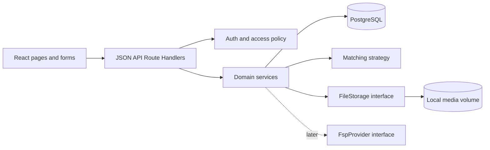

# Архитектура mtch. MVP

Статус: **проект на утверждение**, 30 сентября 2026. Связанные документы: `MVP_PLAN.md`, `DATABASE.md`, `API.md`. Реализация начинается только после явного утверждения плана.

## Стек и способ запуска

- **Next.js + React + TypeScript**: страницы, формы и JSON API в одном приложении.
- **PostgreSQL**: все основные данные; **Drizzle ORM + версионированные SQL-миграции**.
- **Better Auth**: email/пароль, серверные сессии в PostgreSQL и cookie; регистрация дополняется неизменяемой ролью.
- **Docker Compose**: контейнер приложения, контейнер PostgreSQL, постоянные volume для БД и медиа. Отдельный одноразовый шаг миграций перед стартом приложения; demo-конфигурация запускает идемпотентный seed на чистой БД через `SEED_DEMO_DATA=true`, без повторного размножения записей.
- **Node runtime** для API и файлов. Статический экспорт Next.js не подходит для авторизации, БД и uploads.

Версии фиксируются lockfile при создании каркаса. Для публичного размещения потребуется HTTPS и reverse proxy; конкретная площадка определяется после получения сервера/домена.

## Принцип построения

Один deployable modular monolith. Файлы маршрутов отвечают за HTTP, валидацию и передачу управления; бизнес-правила живут в серверных сервисах. UI получает данные через типизированные DTO, а не напрямую из таблиц. Это позволяет сменить визуальный слой без переписывания matching, авторизации и предложений.



Ориентировочная структура после утверждения:

```text
src/app/                     страницы и /api/* Route Handlers
src/components/              UI без доступа к БД
src/features/                формы, DTO, клиентские запросы
src/server/auth/             сессия, роли, ownership
src/server/catalogs/         специализации, города, навыки
src/server/specialists/      профиль и правила публикации
src/server/companies/        компания, контакты, медиа
src/server/search-profiles/  сохранённые критерии поиска
src/server/matching/         интерфейс стратегии и MVP scorer
src/server/offers/           snapshots, статусы, Match
src/server/storage/          FileStorage + LocalFileStorage
src/server/fsp/              FspProvider + no-op adapter
src/db/                      схема, запросы, миграции, seed
```

## Границы и ответственность

| Модуль | Отвечает за | Не должен делать |
|---|---|---|
| Auth/access | проверка сессии, роли, владельца, допуска к контактам | доверять роли из запроса клиента |
| Specialists | валидация и сохранение профиля, статус, список доступных кандидатов | вычислять score или менять предложения |
| Companies | единственная компания работодателя, контакты, медиа и соцсети | управлять чужими компаниями |
| Search profiles | критерии, связи навыков, проверка компании | публиковать вакансии |
| Matching | чистое вычисление 0–100% по двум DTO | читать сессию, загружать файлы, менять БД |
| Offers/Matches | создание условий и snapshots, переходы статусов, открытие контактов | менять условия отправленного предложения |
| Storage | проверенный файл, сохранение/удаление, идентификатор медиа | решать бизнес-права самостоятельно |
| FspProvider | будущая загрузка/нормализация достижений | определять UX до появления спецификации |

## Авторизация и защита данных

Регистрация принимает email, пароль, подтверждение пароля и одну роль. Email нормализуется, уникален в БД. Роль задаётся при регистрации и не редактируется ни через UI, ни через API. Пароль хранит auth-библиотека в виде безопасного хеша. Сессия проверяется на сервере при каждом защищённом запросе. Системные auth-таблицы и политика сессий находятся в PostgreSQL.

Доступ к профилям есть только у вошедших пользователей. Лента и управление компанией, поиском и исходящими предложениями доступны `EMPLOYER`. Свой профиль и входящие предложения управляются только `SPECIALIST`. Чужие сущности проверяются по владельцу в сервисе и запросах к БД. Контакты, включая социальные ссылки компании, не входят в обычные DTO профиля и предложения: отдельный запрос возвращает их только двум участникам существующего Match. Публичные маршруты не отдают личные данные. Медиамаршрут проверяет сессию и право доступа до выдачи файла; запрещает обход путей.

Каждый входящий payload проходит серверную проверку типов, длины, URL, диапазонов и принадлежности связанных ID. Для изменяющих запросов используются cookie-настройки SameSite/HttpOnly/Secure по окружению и проверка origin/CSRF в выбранной конфигурации auth. Ошибки не раскрывают внутренние пути и секреты. В публичном размещении нужны HTTPS, лимиты запросов на вход и загрузку файлов.

## Профили и справочники

Справочники специализаций, городов и навыков хранятся в БД и наполняются seed. Свободный ввод для этих полей не используется. Возможность расширения — добавление записей через миграцию/seed или будущую административную функцию без смены связей профилей. Один специалист выбирает несколько навыков, минимум один. Остальные варианты с фиксированным набором хранятся enum/ограничениями, указанными в `DATABASE.md`.

Профиль появляется в ленте сразу после первого успешного сохранения, если статус не `NOT_LOOKING`. Частично заполненный профиль не публикуется. При редактировании сохраняется та же запись. Возраст вычисляется из даты рождения на момент отображения и не хранится отдельным числом.

UI-скелет включает страницы регистрации/входа, создания и просмотра профиля специалиста, его входящих предложений, создания и просмотра компании, списка Search Profiles, ленты, карточки кандидата, исходящих предложений и списка Match. Навигация разделена по ролям; формы показывают ошибки валидации, загрузку и пустые состояния. Базовая адаптивность проверяется на узком экране. Компоненты UI не импортируют БД или файловое хранилище.

## Matching и лента

MVP scorer — детерминированная реализация интерфейса `MatchingStrategy`. Вход: снимок Search Profile и профиль специалиста; выход: целое число 0–100 и при необходимости объяснение по факторам. Вес навыков — 40, профессии — 20, уровня — 10, опыта — 8, зарплаты — 8, формата — 7, занятости — 7.

| Фактор | Правило MVP |
|---|---|
| Навыки | `40 × (число общих навыков / число навыков Search Profile)`; все навыки поиска равнозначны |
| Профессия | 20 при одинаковом ID специализации, иначе 0 |
| Уровень | 10 при точном совпадении, иначе 0 |
| Опыт | 8, если ранг опыта специалиста не ниже минимального ранга Search Profile |
| Зарплата | 8, если закрытые диапазоны месячной суммы в ₽ пересекаются |
| Формат работы | 7 при точном совпадении |
| Занятость | 7 при точном совпадении |

Сумма округляется до ближайшего целого и ограничивается 0–100. Для незаполненного необязательного поля специалиста соответствующий фактор равен 0. У Search Profile минимум один навык и все scoring-поля обязательны. Scorer не использует ML, LLM, ФСП или внешнюю сеть. После появления новой стратегии можно заменить реализацию за интерфейсом, сохранив API ленты.

При просмотре работодатель передаёт ID своего Search Profile. Сервер выбирает опубликованные профили, исключает `NOT_LOOKING`, применяет выбранные фильтры по AND, вычисляет score, сортирует по `score DESC, specialist_id ASC` и отдаёт страницу с общим количеством. Фильтр навыков в ленте означает наличие **всех** выбранных навыков; выбор одного или нескольких навыков остаётся независимым от scoring. Если объём данных вырастет, вычисление и пагинацию можно перенести в SQL/предвычисление без изменения контракта API. Для demo seed из ~20 специалистов допустимо вычисление в сервисе над ограниченной выборкой БД; данные всё равно хранятся в PostgreSQL.

## Предложения и Match

Форма предложения копирует подходящие значения Search Profile; работодатель может исправить их до отправки. При отправке в одной транзакции сохраняются: явные условия предложения, привязки сторон, snapshots критериев поиска/релевантных данных кандидата, score на момент отправки и статус `SENT`. Изменения профиля и Search Profile впоследствии не меняют эту историю. Редактирования отправленного предложения нет.

Переходы: `SENT` → `ACCEPTED` по действию адресата, `SENT` → `REJECTED` по действию адресата, `SENT` → `WITHDRAWN` по действию работодателя. Конечные состояния не меняются. Принятие и создание Match выполняются в одной транзакции; контакт открывается только после успешного коммита. Частичный уникальный индекс защищает пару работодатель–специалист от второго `SENT`/`ACCEPTED` даже при гонке запросов. После `REJECTED`/`WITHDRAWN` возможна новая запись; существующий Match навсегда запрещает повтор той же пары. У специалиста могут быть Match с несколькими работодателями.

## Файлы и PDF

`FileStorage` принимает проверенный поток, сохраняет файл и возвращает непрозрачный ключ. `LocalFileStorage` хранит байты в Docker volume вне исходников и таблиц БД; таблица медиа хранит ключ, MIME, размер и владельца. Изображения ограничиваются безопасными MIME/сигнатурами, размером (предложение для реализации: до 5 МБ), случайным именем и разрешёнными назначениями `avatar`, `company_logo`, `company_photo`. После загрузки привязка файла к профилю/компании проверяет владельца. Неиспользованные временные файлы удаляются. Подмена хранилища позже не меняет модули профилей и компании.

Для PDF-резюме модель допускает будущую ссылку на медиа, а интерфейс показывает, что загрузка пока недоступна. Файловый PDF endpoint в базовом MVP не включён.

## ФСП после MVP

В базовой архитектуре есть `FspProvider` и no-op реализация без UI, ID пользователя и вымышленных достижений. После 5 октября адаптер будет построен по реальной спецификации. Схема хранения достижений, способ связывания участника с аккаунтом, обновление данных и использование в демонстрации проектируются по фактическому контракту и оформляются отдельной миграцией. Базовый matching от этого не зависит.

## Модуль производственной практики

Модуль `src/server/practice/` отделён от обычного scorer, `Search Profile`, `Offer` и `Match`: набор и приглашение имеют собственные условия и воронку. Профиль специалиста расширен целью поиска и nullable-полями практики. Миграция сохраняет все существующие профили со значением `OPEN_TO_OFFERS`; зарплата может быть `NULL` только для `PRACTICE`. Наборы принадлежат существующей компании работодателя, а все операции проверяют роль и ownership на сервере.

Подбор сначала исключает неподходящие цель, статус поиска, даты, направление, формат, город и курс; затем считает score по навыкам и существующим данным опыта/портфолио. Причины формируются из тех же проверенных фактов. ФСП не даёт фиктивных баллов и не рисуется в интерфейсе до интеграции с реальным контрактом. Приглашения имеют частичный unique индекс на активные статусы в паре набор–студент; переходы и заполнение мест защищены транзакцией с блокировкой строки набора. `slotsFilled` вычисляется по приглашениям `HIRED`, поэтому отдельный изменяемый счётчик не расходится с воронкой.

## Проверяемость и эксплуатация

Unit-тесты (Vitest) проверяют scorer и переходы статусов; интеграционные тесты — БД, ownership, дубликаты и snapshots; браузерный smoke (Playwright) — регистрацию, два кабинета, ленту, предложение и Match через запущенное приложение. Health endpoint отдельно проверяет готовность приложения и БД. Compose и README должны воспроизводить запуск на чистой машине. Публичный деплой добавляет TLS, reverse proxy, резервное копирование БД/медиа и конфигурацию домена после предоставления инфраструктуры.
